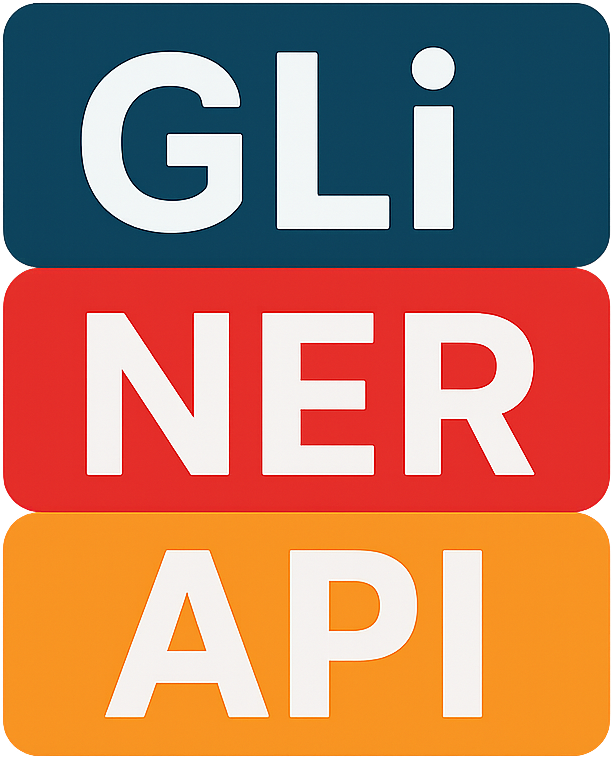

<div align="center">

# gliner-api

## A minimal FastAPI app serving GLiNER models.

[](https://github.com/freinold/gliner-api/blob/main/LICENSE)
[](https://github.com/freinold/gliner-api/actions/workflows/github-code-scanning/codeql)
[](https://github.com/freinold/gliner-api/actions/workflows/docker-release.yml)
[](https://scorecard.dev/viewer/?uri=github.com/freinold/gliner-api)

  
</div>

## Features

- **FastAPI** backend for serving GLiNER models (NER).
- **Gradio** frontend (optional) for interactive use.
- **Prometheus** metrics endpoint (`/metrics`).
- **Configurable** via YAML, CLI, or environment variables.
- **Docker** and **Docker Compose** support.
- **ONNX** inference support (including quantized models).
- **API key** authentication (optional).
- **Custom metrics port** and enable/disable option for Prometheus metrics.

---

## Usage

### Run with Docker

You can either build the container yourself or use a prebuilt image from GitHub Container Registry.

#### Run prebuilt container (recommended)

```bash
docker run \
  -p 8080:8080 \
  -p 9090:9090 \
  -v $(pwd)/config.yaml:/app/config.yaml \
  -v $HOME/.cache/huggingface:/app/huggingface \
  ghcr.io/freinold/gliner-api:0.1.0-rc4
```

- `-v $(pwd)/config.yaml:/app/config.yaml` mounts your config file (edit as needed)
- `-v $HOME/.cache/huggingface:/app/huggingface` mounts your Huggingface cache for faster model loading

#### Build and run locally (CPU version)

```bash
docker build -f cpu.Dockerfile -t gliner-api .
docker run \
  -p 8080:8080 \
  -p 9090:9090 \
  -v $(pwd)/config.yaml:/app/config.yaml \
  -v $HOME/.cache/huggingface:/app/huggingface \
  gliner-api
```

---

### Run with Docker Compose

Edit [`compose.yaml`](compose.yaml) to select the config you want (see `example_configs/`).

Then start:

```bash
docker compose up --build
```

---

### Run the app directly

Be sure to check the [installation instructions](#installation) first.

```bash
uv run main.py [OPTIONS]
```

Or with FastAPI CLI:

```bash
fastapi run main.py --host localhost
```

#### Run options

```bash
uv run main.py --help
```

| Option                  | Description                                               | Default                                          |
| ----------------------- | --------------------------------------------------------- | ------------------------------------------------ |
| `--use-case` / `--name` | Use case for the GLiNER model (application/domain)        | `general`                                        |
| `--model-id`            | Huggingface model ID ([browse models][gliner-models])     | `knowledgator/gliner-x-base`                     |
| `--onnx-enabled`        | Use ONNX for inference                                    | `False`                                          |
| `--onnx-model-path`     | Path to ONNX model file                                   | `model.onnx`                                     |
| `--default-entities`    | Default entities to detect                                | `['person', 'organization', 'location', 'date']` |
| `--default-threshold`   | Default detection threshold                               | `0.5`                                            |
| `--api-key`             | API key for authentication (if set, required in requests) | `null`                                           |
| `--host`                | Host address                                              | `0.0.0.0`                                        |
| `--port`                | Port                                                      | `8080`                                           |
| `--metrics-enabled`     | Enable Prometheus metrics endpoint                        | `True`                                           |
| `--metrics-port`        | Port for Prometheus metrics endpoint                      | `9090`                                           |
| `--frontend-enabled`    | Enable Gradio frontend                                    | `True`                                           |

[gliner-models]: https://huggingface.co/models?library=gliner&sort=trending

---

## API & Frontend

- **API docs:** `/docs` (Swagger UI), `/redoc`
- **Prometheus metrics:** `/metrics` (if enabled, served on a separate port, e.g. 9090)
- **Gradio frontend:** `/` (if enabled)

---

## Example Request

```bash
curl -X POST "http://localhost:8080/api/invoke" -H "Content-Type: application/json" -d '{"text": "Steve Jobs founded Apple in Cupertino."}'
```

---

## Installation

**Prerequisites:**

- Python 3.12.11
- [uv](https://github.com/astral-sh/uv) (for dependency management)

**Install dependencies:**

```bash
# CPU version
uv sync --extra cpu [--extra frontend]

# GPU version
uv sync --extra gpu [--extra frontend]
```

The frontend is optional, but encouraged for interactive use.

**Install from source:**

```bash
git clone https://github.com/freinold/gliner-api.git
cd gliner-api
uv sync --extra cpu  # or --extra gpu
```

---

## Configuration

You can configure the app via:

- `config.yaml` (default, see `example_configs/`)
- CLI options (see above)
- Environment variables (prefix: `GLINER_API_`)

Example configs:

- `example_configs/general.yaml` (default NER)
- `example_configs/pii.yaml` (PII detection)
- `example_configs/medical.yaml` (medical NER)
- `example_configs/general_onnx.yaml` (ONNX inference)
- `example_configs/general_onnx_quantized.yaml` (quantized ONNX)

---

## Used Frameworks & Libraries

- [FastAPI](https://fastapi.tiangolo.com/) (API backend)
- [Gradio](https://gradio.app/) (optional frontend)
- [Uvicorn](https://www.uvicorn.org/) (ASGI server)
- [Prometheus Client](https://github.com/prometheus/client_python) (metrics)
- [Huggingface Hub](https://huggingface.co/docs/huggingface_hub) (model loading)
- [PyTorch](https://pytorch.org/) (CPU/GPU inference)
- [ONNX](https://onnx.ai/) (optional, for ONNX models)
- [uv](https://github.com/astral-sh/uv) (dependency management)

---

## License

See [LICENSE](LICENSE).

---
